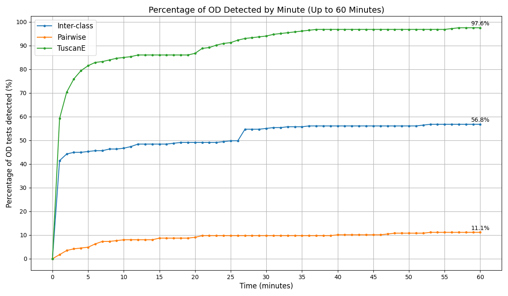

The authors of "Generation of Test Orders for Efficient Order-Dependent Flaky Test Detection" make their best attempt to anonymize the following artifacts. Note that it may still be possible to reveal the identities of the authors by deeply studying the artifacts.

## Additional Data for FSE rebuttal:

1. Reviewer A. Q1: Comparison of the % of OD detection between TuscanE, Tuscan interclass & Pairwise when orders are generated and run simultaneously up to 60 minutes simultaneously:



## Artifact:

1. Code for TuscanE to generate test-orders : inside the TuscanECodes/ directory

2. Tuscan inter-class code from the paper "Systematically Producing Test-Orders to Detect Order-Dependent Flaky Tests" - https://sites.google.com/view/systematically-detecting-od/home

3. Code for "pairwise" approach to generate test-orders - inside the PairwiseCodes/ directory

4. Details of the Modules used in our Dataset - subjects.csv file

## Setup

We recommend using a Linux system with Python 3.6+ and Bash. The generation scripts use bash and Java.
Install dependencies (if needed):

```bash
sudo apt install python3 python3-pip
```
```bash
pip3 install pandas
```
## Order Generation

If you have a single file with fully qualified test names for a project run
```bash
bash generate_orders_from_set_of_test.sh <file_with_fully_qualified_test_names>
```
**Make sure to add all the fully qualified test names in new lines**

If you have multiple modules, execute the following scripts to generate test orders for the modules in `modules.csv`. Use `original-orders` as an input directory, where each module’s fully qualified test names are listed in a separate file.
```bash
bash generate_orders.sh modules.csv inter
```
Input: modules.csv, `original-orders`  
Output: Test orders saved to the outputs/ directory  
Original test orders: Stored in the original-orders/ directory

TuscanE can be used by generating the orders and executing them with existing tools (e.g., Original-Order mode of iDFlakies- https://github.com/UT-SE-Research/iDFlakies)